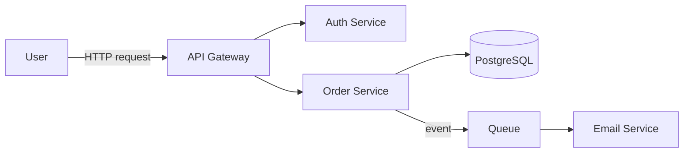
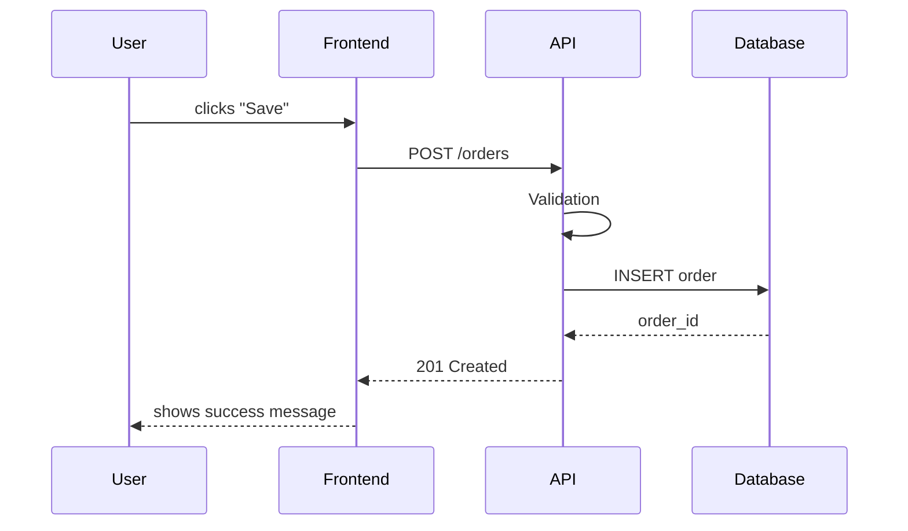
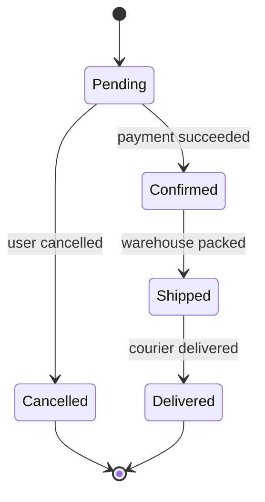

# Diagram Selection Guide

Choosing the right diagram type matters more than polishing the wrong one.

| What you're showing | Mermaid type | Why |
|---|---|---|
| Overall architecture, relationships between modules | `flowchart` (TD or LR) | Boxes + arrows, most readable overview |
| A request's journey over time (A calls B, B calls C) | `sequenceDiagram` | Who calls whom, in what order — clearest form |
| Database schema, table relationships | `erDiagram` | The standard for relational structure |
| OOP relationships between classes/interfaces | `classDiagram` | Inheritance and composition are visible |
| An entity moving through states (order: pending→confirmed→shipped) | `stateDiagram-v2` | The right tool for state machines |
| Timeline / release flow | `gitGraph` or a simple `flowchart LR` | Chronology |

**Rule: at most 8–10 nodes per diagram.** If you need more, split it (e.g. "top-level architecture" + a separate "auth sub-flow").

## Examples

### Architecture (flowchart)

Notes:
- `[(...)]` is the database shape, `[...]` a normal box, `{...}` a decision point
- Direction: `LR` (left-to-right) usually reads better for architecture, `TD` (top-down) for processes
- Labeled arrows (`-->|event|`) show what flows, not just "connected"

### Request flow (sequenceDiagram)

Notes:
- `->>` is a synchronous call, `-->>` a response/return
- Every arrow must correspond to a real function/line of code — never invent
- Keep participants to 6 or fewer; split the flow if you need more

### State machine (stateDiagram-v2)

Notes:
- Transition labels (`: payment succeeded`) show what triggers the move — without them the diagram is just boxes and arrows
- `[*]` marks start/end
