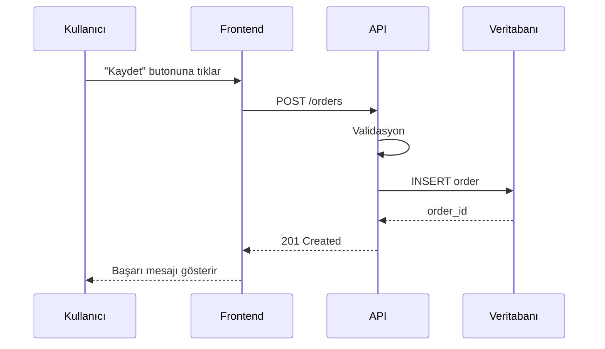
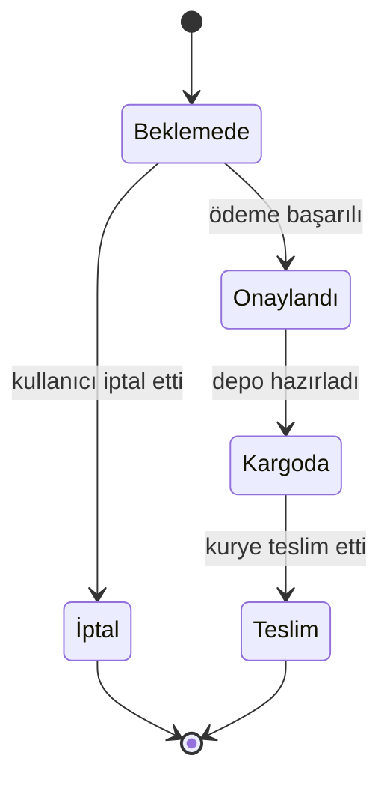

# Diyagram Seçim Rehberi

Doğru diyagram tipini seçmek, yanlış tipi güzelleştirmekten daha önemli. Aşağıdaki tablo hangi durumda hangisini kullanacağını gösterir.

| Ne anlatıyorsun | Mermaid tipi | Kullan çünkü |
|---|---|---|
| Genel mimari, modüller arası ilişki | `flowchart` (TD veya LR) | Kutular + oklar, en okunaklı genel bakış |
| Bir isteğin zaman içindeki yolculuğu (A çağırır B'yi, B çağırır C'yi) | `sequenceDiagram` | Kim kimi, hangi sırada çağırıyor — en net gösterim |
| Veritabanı şeması, tablolar arası ilişki | `erDiagram` | İlişkisel yapı için standart |
| Sınıflar/interface'ler arası OOP ilişkisi | `classDiagram` | Kalıtım, kompozisyon net görünür |
| Bir varlığın durumdan duruma geçişi (sipariş: beklemede→onaylandı→kargoda) | `stateDiagram-v2` | Durum makineleri için doğru araç |
| Zaman çizelgesi / release akışı | `gitGraph` veya basit `flowchart LR` | Kronoloji |

**Kural: Bir diyagramda en fazla 8-10 düğüm olsun.** Daha fazlası gerekiyorsa, diyagramı böl (örn. "üst seviye mimari" + ayrı "auth alt akışı").

## Örnekler

### Mimari (flowchart)

Notlar:
- `[(...)]` veritabanı şekli, `[...]` normal kutu, `{...}` karar noktası
- Yön: mimari için genelde `LR` (soldan sağa) daha okunaklı, süreç akışları için `TD` (yukarıdan aşağı)
- Etiketli oklar (`-->|event|`) neyin aktığını gösterir, sadece "bağlı" demez

### İstek akışı (sequenceDiagram)

Notlar:
- `->>` senkron çağrı, `-->>` cevap/dönüş
- Her ok gerçek bir kod satırına/fonksiyona karşılık gelmeli, uydurma
- Katılımcı (`participant`) sayısı 6'yı geçmesin, geçiyorsa akışı böl

### Durum makinesi (stateDiagram-v2)

Notlar:
- Geçiş etiketleri (`: ödeme başarılı`) neyin tetiklediğini gösterir — bu olmadan diyagram sadece kutu-ok yığını olur
- `[*]` başlangıç/bitiş noktası
