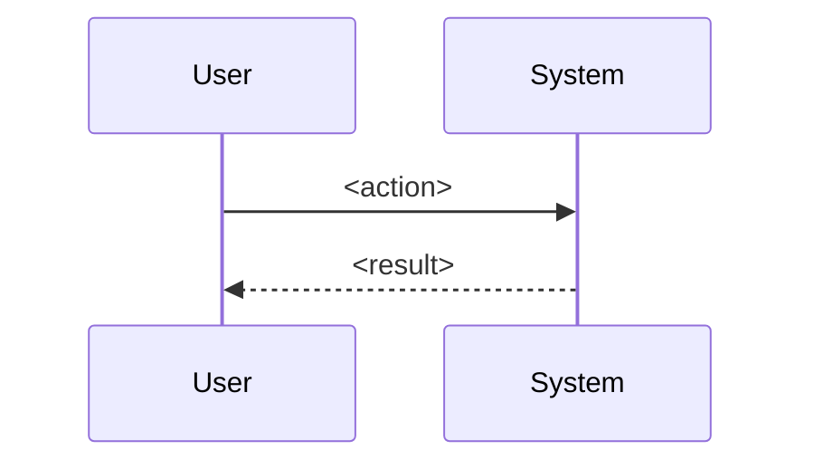

# <Project Name> — Project Guide
<!-- Skeleton of the target document shape. Section order is fixed; drop sections that don't apply. -->

> One-breath thesis: what this is, who it serves, in a blockquote.

---

## 1. Why does this exist?

| Gap | Consequence |
|---|---|
| <structural gap 1> | <what goes wrong> |
| <structural gap 2> | <what goes wrong> |

<Solution as 2–4 numbered responsibilities.>

Analogy: <ONE load-bearing analogy, reused throughout the doc>.

---

## 2. UI anatomy  <!-- only if there is a UI -->


- **<Region>** — what it shows.
- **<Region>** — what it shows.

<State the project's thesis as expressed by the UI.>

---

## 3. Lifecycle of one unit of work

<Name ONE real user action and trace it.>



**<The single most important timing/architecture fact, in bold.>**

<details>
<summary>Technical details</summary>

- Exact call chain with `file.py:line` references (grep-verified).
- The "why" behind each non-obvious phase.

</details>

---

## 4. Components

| Component | Tab/Area | Its question | Lifetime |
|---|---|---|---|
| <name> | <where visible> | "<what it answers>" | <session/persistent> |

### 4.1 <Component>


<Plain-prose what it does. Crisp rules ("holds X, overwrites on conflict, writes immediately"). One analogy extending the load-bearing one.>

<details>
<summary>Technical details</summary>

- `path/to/file.py` — mechanism, thresholds, config values, design rationale mined from docstrings.

</details>

<!-- repeat per component -->

---

## 5. What the data actually looks like

```json
// <layer name> (one-line caption)
{ "shortened": "real sample" }
```

---

## 6. Honest operational notes

> **Note:** <anything disabled by default / env-dependent / surprising, and how to change it>.

---

## 7. How to run

```bash
<exact commands>
```

```env
<env file with placeholder keys>
```

| Endpoint | Returns |
|---|---|
| `GET /...` | <what> |

---

## 8. Directory map

```
dir/            comment that adds information (not a restatement of the name)
  file.py       what it is FOR
```

Dependency rule: **<one sentence, e.g. "the agent knows the engine; the engine never knows the agent">.**

---

## 9. Test yourself

1. <Mechanism-probing question answerable from this document.>
2. <...4–6 total.>

<details>
<summary>Known gaps</summary>

- <Link/paraphrase items from the repo's own known-issues doc, with section pointers.>

</details>
